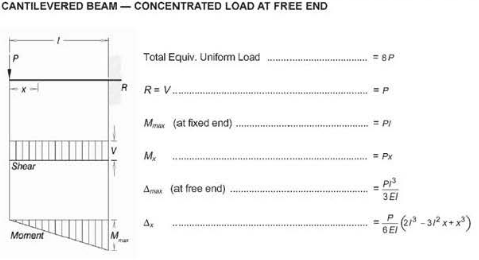

Example
=======

The purpose of this example is to demonstrate how to solve a cantilevered pipe
problem using standard engineering strength of materials formulations and using
PSI's finite element capabilities.

Problem
-------

A 10 *feet* long, 10" schedule 40 cantilevered pipe is anchored at one end
with a 1000 *lbf* force (P) acting on the other. What is the tip deflection
at the end with the force? What is the reaction force (R) at the fixed end?

Methodology
-----------

The deflections and reaction forces are derived using strength of materials
formulations and calculated using the formulas in :ref:`Figure 1 <fig-1>`.

Acceptance Criteria
-------------------

1. ASME B31.1 1967 Edition

Assumptions
-----------

1. The pipe is made of Standard Steel with a Young's Modulus of 2.9e7 *psi*.
2. Shear deflection effects are negligible.

Inputs
------

Under Construction!

Analysis
--------

The applied end force results in:

1. a downward deflection at the tip and zero deflection at the anchor point
2. an upward reaction force and clockwise moment at the fixed end. See the
   internal force and moment diagram.

    *Figure 1:* Shear and Bending Moment Diagrams :ref:`[1] <ref-sec>`

.. math::
   :label: umax

    \Delta_{max} = Pl / 3EI

.. math::
   :label: shear

    R = P

.. math::
   :label: mmax

    M_{max} = Pl

Where:

.. math::
    :label: amoi

    I = (\pi/32)(d_o^4 - d_i^4)

Results
-------

Plugging into the formulas from :ref:`Figure 1 <fig-1>` and solving for the
deflection :eq:`Eqn. 1 <umax>`, shear :eq:`Eqn. 2 <shear>`, and max moment
:eq:`Eqn. 3 <mmax>` gives:

.. jupyter-execute::
    :hide-code:

    import pint
    ureg = pint.UnitRegistry()

    P = 1000*ureg.lbf
    l = 10*ureg.feet

    Mmax = P*l

    print("Mmax = {}".format(Mmax))

Source Code
-----------

The PSI code listing below is used to solve the cantilevered beam pipe example
above.

.. literalinclude:: ../../examples/demo.inp
    :language: python
    :linenos:
    :caption: Code Listing

.. literalinclude:: ../../examples/demo.out
    :linenos:
    :caption: PSI Output
    :emphasize-lines: 5, 16, 19, 22, 30, 45

Conclusions
-----------

Under Construction!

.. _ref-sec:

References
----------

1. AISC ASD 9th Edition
